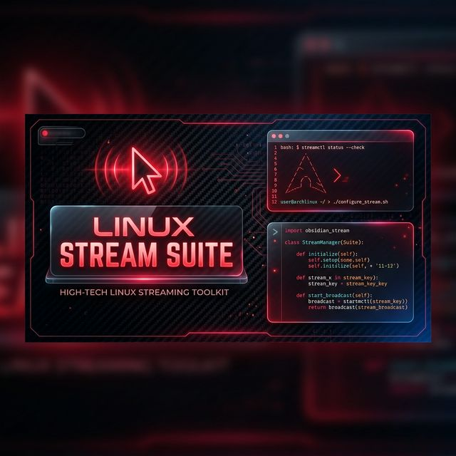

# 🚀 Anibal Copitan's Stream Suite

A collection of specialized automation tools and utilities for high-performance live streaming on **Linux**, curated by [Anibal Copitan](https://anibalcopitan.com).



> [!TIP]
> Built for the **aniballinux** community on TikTok, YouTube, and FB. 🐧🔥

## 🛠 Included Tools

### 🔴 [Mouse-Overlayer](./mouse-overlayer)
A Python (PyQt6) application that adds a customizable glow and click-indicators to your cursor. Perfect for tutorials and coding streams.

### 🖥 [Screen Sharing Suite](./screen-sharing)
A suite of `x11vnc` scripts pre-configured for different screen regions and resolutions:
-   **Full Screen**: Optimized for high refresh rates.
-   **Clipped Regions**: Share only what matters.
-   **Mobile/Monitor Pre-sets**: Switch layouts in seconds.

### 🌐 [Browser Automation](./browser-automation)
Scripts to launch your streaming environment (Tikfinity, TikTok Feed, Blog) in a clean, dedicated profile.

## 🚀 Getting Started

1.  **Clone the suite**:
    ```bash
    git clone https://github.com/anibal.linux/aniballinux-live.git
    cd aniballinux-live
    ```
2.  **Run Mouse-Overlayer**:
    ```bash
    make overlay
    ```
    *(The first time it will automatically create the environment and install dependencies).*

### 🚀 One-Command Launch
To start your entire environment (Overlay + Stream + Brave) at once:
```bash
make start
```

## 🛠 Individual Commands
If you prefer manual control:
- `make overlay`: Mouse highlight.
- `make stream`: Screen Capture.
- `make brave`: Browser setup.

## 🤝 Comunidad y Aprendizaje
Este toolkit es de código abierto para demostrar mis habilidades y ayudar a la comunidad de streamers en Linux. 

- **¿Quieres aprender?**: Comparto el proceso detrás de estas herramientas en mis en vivo.
- **¿Buscas algo personalizado?**: Si necesitas una herramienta a medida para tu stream, contáctame.

---
Hecho con pasión por un Linuxer. 🐧🔥
